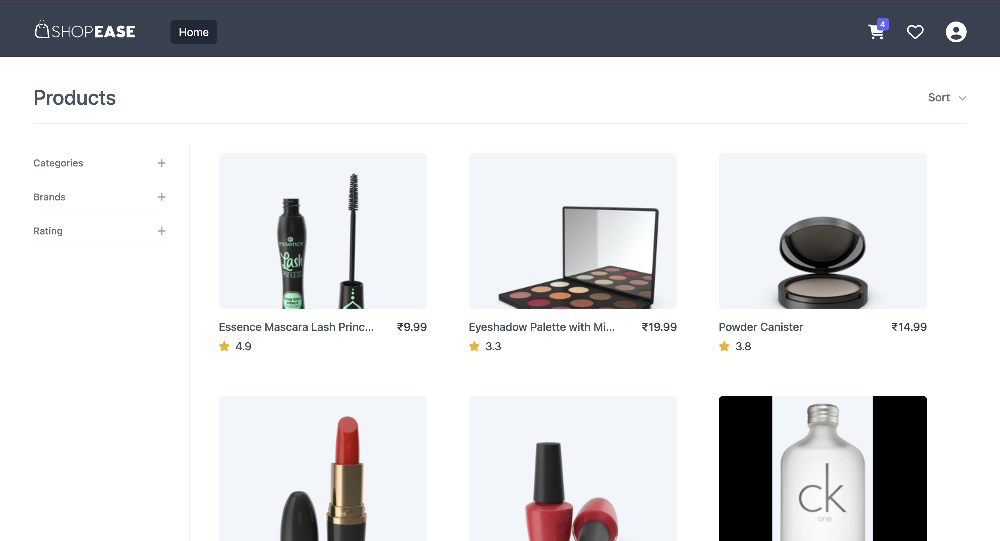

# Shopease

## 0. Table of Contents

1. [Overview](#1-overview)
2. [Live Deployment](#2-live-deployment)
3. [Demo Video](#3-demo-video)
4. [Main Features](#4-main-features)
5. [Advance Features](#5-advance-features)
6. [Tools and technologies used](#6-tools-and-technologies-used)

## 1. Overview

Shopease is an e-commerce platform designed to provide a seamless shopping experience to users. With a vast selection of products ranging from electronics and fashion to home goods and beauty products, Shopease aims to cater to all your shopping needs in one location.

## 2. Live Deployment

Shopease is deployed on a DigitalOcean Droplet using Nginx as a web server and is linked to a custom domain. `Live link` of the deployed project - [click here](http://shopease.shubhampurwar.in).

## 3. Demo Video

Demo video of the project is uploaded on youtube. To watch the demo video, [click here](https://youtu.be/AXzd7vaG-7Q).

## 4. Main Features

- Authentication
  - User signup
  - User login
  - User logout
- Cart management
  - Add item to cart
  - Remove item from cart
  - Update item quantity
  - Clear cart
- Wishlist management
  - Add item to wishlist
  - Remove item from wishlist
  - Clear wishlist
- Manage addresses
  - Add new address
  - Update an address
  - Delete an address
  - Set an address as default
- Profile management
  - Update profile - first name, last name, phone, password
  - Delete account
- Products
  - Filter by category, brand and rating
  - Sort by rating, newly added, price-low to high and price-high to low
- View order history
- Admin panel
  - Product management
    - Add new product
    - Update product details
    - Delete a product
    - Filter and sort products
  - User management
    - Update user role
    - Delete a user
  - Order management
    - Update order status
    - Delete an order
    - Sort orders by amount - asc or desc

## 5. Advance Features

- Pagination to render large lists of products, orders and users
- Sanitization and validation of data entered in React Forms
- Lazy loading to import bundles only when they are required, thereby reducing the initial bundle size
- Memoization of React components and expensive calculations using memo function and useMemo hook
- Best practices of React and Redux to minimize unnecessary re-renders
- Custom hooks to handle components like modals and dropdowns

## 6. Tools and technologies used

- Create React App to initialize React project
- Tailwind CSS to style UI components
- React Router v6 to implement client-side routing
- Redux to save global state in an external store
- Redux Thunks to fetch data from APIs and save it in a Redux store
- Axios client to send HTTP requests
- JSON Server as a mock backend to serve incoming API requests
- Configured PM2 to keep JSON Server running as a daemon process to ensure availability
- Morgan to log information about HTTP requests
- Deployed on a DigitalOcean Droplet using Nginx as a web server
